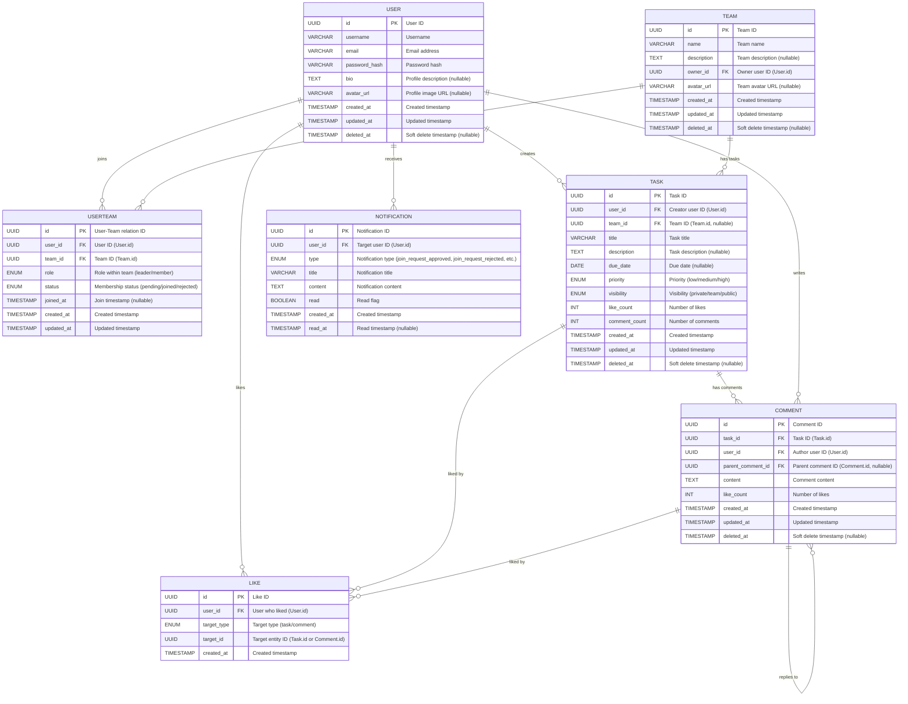

```mermaid
erDiagram
    USER {
        UUID id PK "User ID"
        VARCHAR username "Username"
        VARCHAR email "Email address"
        VARCHAR password_hash "Password hash"
        TEXT bio "Profile description (nullable)"
        VARCHAR avatar_url "Profile image URL (nullable)"
        TIMESTAMP created_at "Created timestamp"
        TIMESTAMP updated_at "Updated timestamp"
        TIMESTAMP deleted_at "Soft delete timestamp (nullable)"
    }

    TEAM {
        UUID id PK "Team ID"
        VARCHAR name "Team name"
        TEXT description "Team description (nullable)"
        UUID owner_id FK "Owner user ID (User.id)"
        VARCHAR avatar_url "Team avatar URL (nullable)"
        TIMESTAMP created_at "Created timestamp"
        TIMESTAMP updated_at "Updated timestamp"
        TIMESTAMP deleted_at "Soft delete timestamp (nullable)"
    }

    USERTEAM {
        UUID id PK "User-Team relation ID"
        UUID user_id FK "User ID (User.id)"
        UUID team_id FK "Team ID (Team.id)"
        ENUM role "Role within team (leader/member)"
        ENUM status "Membership status (pending/joined/rejected)"
        TIMESTAMP joined_at "Join timestamp (nullable)"
        TIMESTAMP created_at "Created timestamp"
        TIMESTAMP updated_at "Updated timestamp"
    }

    TASK {
        UUID id PK "Task ID"
        UUID user_id FK "Creator user ID (User.id)"
        UUID team_id FK "Team ID (Team.id, nullable)"
        VARCHAR title "Task title"
        TEXT description "Task description (nullable)"
        DATE due_date "Due date (nullable)"
        ENUM priority "Priority (low/medium/high)"
        ENUM visibility "Visibility (private/team/public)"
        INT like_count "Number of likes"
        INT comment_count "Number of comments"
        TIMESTAMP created_at "Created timestamp"
        TIMESTAMP updated_at "Updated timestamp"
        TIMESTAMP deleted_at "Soft delete timestamp (nullable)"
    }

    COMMENT {
        UUID id PK "Comment ID"
        UUID task_id FK "Task ID (Task.id)"
        UUID user_id FK "Author user ID (User.id)"
        UUID parent_comment_id FK "Parent comment ID (Comment.id, nullable)"
        TEXT content "Comment content"
        INT like_count "Number of likes"
        TIMESTAMP created_at "Created timestamp"
        TIMESTAMP updated_at "Updated timestamp"
        TIMESTAMP deleted_at "Soft delete timestamp (nullable)"
    }

    LIKE {
        UUID id PK "Like ID"
        UUID user_id FK "User who liked (User.id)"
        ENUM target_type "Target type (task/comment)"
        UUID target_id "Target entity ID (Task.id or Comment.id)"
        TIMESTAMP created_at "Created timestamp"
    }

    NOTIFICATION {
        UUID id PK "Notification ID"
        UUID user_id FK "Target user ID (User.id)"
        ENUM type "Notification type (join_request_approved, join_request_rejected, etc.)"
        VARCHAR title "Notification title"
        TEXT content "Notification content"
        BOOLEAN read "Read flag"
        TIMESTAMP created_at "Created timestamp"
        TIMESTAMP read_at "Read timestamp (nullable)"
    }

    USER ||--o{ USERTEAM : "joins"
    TEAM ||--o{ USERTEAM : "has members"
    USER ||--o{ TASK : "creates"
    TEAM ||--o{ TASK : "has tasks"
    TASK ||--o{ COMMENT : "has comments"
    COMMENT ||--o{ COMMENT : "replies to"
    USER ||--o{ COMMENT : "writes"
    USER ||--o{ LIKE : "likes"
    TASK ||--o{ LIKE : "liked by"
    COMMENT ||--o{ LIKE : "liked by"
    USER ||--o{ NOTIFICATION : "receives"
```