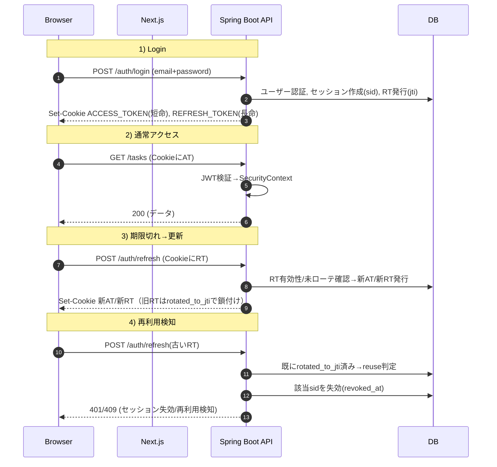

# 認証/認可設計（Next.js × Spring Boot / JWT + Cookie）

**Scope**: 本書は Tosk（Todo+SNS）における Web 認証・認可の詳細設計をまとめる。フロントは Next.js、バックエンドは Spring Boot。**アクセストークンは短命 JWT、リフレッシュトークンは長命 JWT** を **HttpOnly/Secure Cookie** で運用し、**トークンローテーション＋再利用検知**、**セッション（端末）単位の失効**、**ドメインモデルに沿った認可**を行う。

---

## 1. 全体アーキテクチャ

* 認証: JWT（署名: RS256）を Cookie で配布。アクセストークン（短命）とリフレッシュトークン（長命）の二層構成。
* セッション: `sid`（セッションID, UUID）で端末単位を追跡。`user_session`・`refresh_token` テーブルで管理。
* 失効: `users.token_version` により「全端末一括失効」。個別端末は `user_session.revoked_at`。
* 認可: `Task.visibility`（private/team/public）と `UserTeam.role/status` に基づく **Resource-Based Policy**。
* CSRF/CORS: 同一サイト前提で `SameSite=Strict`。クロスサイト構成時は `SameSite=None`＋Origin 検証 or ダブルサブミット。
* ログ/監査: `requestId`, `userId`, `sid`, `jti` を構造化出力。

### 1.1 認証フロー（概要）



---

## 2. JWT 設計

### 2.1 署名・ヘッダ

* アルゴリズム: `RS256`
* `kid`（Key ID）を付与。鍵は KMS/Secrets 管理。ローテーション前提。
* クロックスキュー許容: 検証時は ±60 秒の時刻ずれを許容（`iat/nbf/exp`）。

### 2.2 クレーム（アクセストークン）

* 標準: `iss`, `sub`(userId: UUID), `iat`, `exp`(15–30分), `jti`(UUID), `nbf`
* 追加: `sid`(セッションID), `ver`(tokenVersion), `roles`(グローバルロール最小限)

    * チーム/タスク単位の権限は **毎回DB照会**によるポリシー評価で判定（JWTに詰めない）。

### 2.3 クレーム（リフレッシュトークン）

* 標準: `iss`, `sub`, `iat`, `exp`(14日程度), `jti`
* 追加: `sid`, `ver`

### 2.4 Cookie 属性（推奨値）

* `ACCESS_TOKEN`: `HttpOnly; Secure; SameSite=Strict; Path=/; Max-Age=1800`
* `REFRESH_TOKEN`: `HttpOnly; Secure; SameSite=Strict; Path=/auth; Max-Age=1209600`
* クロスサイトの場合: `SameSite=None; Secure`（**必須**）＋Origin 検証/CSRF対策を併用。

---

## 3. データモデル（PostgreSQL）

### 3.1 既存 `users` 拡張

```sql
ALTER TABLE users
  ADD COLUMN token_version INTEGER NOT NULL DEFAULT 0;
```

### 3.2 端末セッション

```sql
CREATE TABLE user_session (
  sid UUID PRIMARY KEY,
  user_id UUID NOT NULL REFERENCES users(id) ON DELETE CASCADE,
  user_agent_hash TEXT NOT NULL,
  ip_hash TEXT NOT NULL,
  created_at TIMESTAMPTZ NOT NULL DEFAULT now(),
  last_seen_at TIMESTAMPTZ NOT NULL DEFAULT now(),
  revoked_at TIMESTAMPTZ
);
CREATE INDEX idx_user_session_user ON user_session(user_id);
```

### 3.3 リフレッシュトークン

```sql
CREATE TABLE refresh_token (
  jti UUID PRIMARY KEY,
  sid UUID NOT NULL REFERENCES user_session(sid) ON DELETE CASCADE,
  user_id UUID NOT NULL REFERENCES users(id) ON DELETE CASCADE,
  expires_at TIMESTAMPTZ NOT NULL,
  created_at TIMESTAMPTZ NOT NULL DEFAULT now(),
  last_used_at TIMESTAMPTZ,
  rotated_to_jti UUID,
  revoked_at TIMESTAMPTZ,
  detected_reuse_at TIMESTAMPTZ
);
CREATE INDEX idx_refresh_token_sid ON refresh_token(sid);
CREATE INDEX idx_refresh_token_user ON refresh_token(user_id);
```

**運用ルール**

* RTは **1回限り使い切り**。`/auth/refresh` で新 `jti` を払い出し、旧 `jti` の `rotated_to_jti` を埋める。
* 既に `rotated_to_jti` 済みの `jti` で再度アクセスが来た場合は **再利用検知** として `detected_reuse_at` を記録し、同 `sid` を失効。

---

## 4. API 仕様（MVP）

> **共通**: Cookie(AT/RT) は HttpOnly。エラーレスポンスは JSON（例: `{"error":"UNAUTHORIZED","message":"...","requestId":"..."}`）。

### 4.1 `POST /auth/login`

* 入力: `{ email, password }`
* 処理: 資格情報検証 → `sid` 作成 → AT/RT 発行・Set-Cookie（Bodyはメッセージのみ）
* 出力例: `{ message: "ok" }`
* 後続フロー: 直後に `GET /auth/me` を呼び、プロフィールを取得
* エラー: 無効な資格情報は `401 UNAUTHORIZED`
* レート制限: IP + email でバックオフ

### 4.2 `POST /auth/refresh`

* 匿名アクセス可。RT Cookie 必須。
* 有効 RT かつ未ローテ → 新 AT/RT を発行し旧 RT を鎖付け（`rotated_to_jti`）。
* 既ローテ RT が来たら **再利用検知** → `sid` 失効 → `409 TOKEN_REUSE_DETECTED`。

### 4.3 `POST /auth/logout`

* 現在の `sid` を `revoked_at` 更新。AT/RT Cookie を即時失効（`Max-Age=0`）。

### 4.4 `GET /auth/me`

* AT 必須。現在ユーザー最小情報を返却。UI の初期化用。

> 将来拡張: `/auth/email/verify/*`, `/auth/password/reset/*`, `/auth/mfa/*`（TOTP）

---

## 5. 認可ポリシー（Resource-Based）

### 5.1 Task 可視性

* `private`: 作成者本人のみ（管理者は監査目的で可）
* `team`: 同一チームの `JOINED` メンバー（`PENDING`/`REJECTED` は不可）
* `public`: 認証済みユーザー全員（必要なら匿名でも可、今回は認証済みに限定）

### 5.2 実装の型

* `TaskVisibilityPolicy.canRead(user, task)` / `canUpdate` / `canDelete`
* Controller から `@PreAuthorize("@taskPolicy.canRead(#taskId)")` 等で適用

---

## 6. Spring Security 実装

### 6.1 Filter Chain（概略）
たとえば、、
```java
@Bean
SecurityFilterChain security(HttpSecurity http) throws Exception {
  return http
    .csrf(csrf -> csrf.disable()) // 同一サイト運用 or 別途Origin検証
    .cors(Customizer.withDefaults())
    .sessionManagement(sm -> sm.sessionCreationPolicy(SessionCreationPolicy.STATELESS))
    .authorizeHttpRequests(auth -> auth
      .requestMatchers("/auth/login", "/auth/refresh", "/health").permitAll()
      .anyRequest().authenticated())
    .exceptionHandling(ex -> ex
      .authenticationEntryPoint(restAuthEntryPoint)
      .accessDeniedHandler(restAccessDeniedHandler))
    .addFilterBefore(jwtAuthenticationFilter, UsernamePasswordAuthenticationFilter.class)
    .build();
}
```

### 6.2 JwtAuthenticationFilter（要点）

* `ACCESS_TOKEN` Cookie から取得 → 検証（署名, exp, `ver`=DBの`token_version`一致, `sid`未失効）→ `SecurityContext` へ。
* 検証失敗時は 401 を JSON で返す（HTMLリダイレクトしない）。

### 6.3 Cookie 発行（サンプル）

```java
ResponseCookie at = ResponseCookie.from("ACCESS_TOKEN", token)
  .httpOnly(true).secure(true).path("/")
  .sameSite("Strict").maxAge(Duration.ofMinutes(30))
  .build();
ResponseCookie rt = ResponseCookie.from("REFRESH_TOKEN", refresh)
  .httpOnly(true).secure(true).path("/auth")
  .sameSite("Strict").maxAge(Duration.ofDays(14))
  .build();
response.addHeader(HttpHeaders.SET_COOKIE, at.toString());
response.addHeader(HttpHeaders.SET_COOKIE, rt.toString());
```

> クロスサイト時は `sameSite("None")` を選び、**HTTPS前提**で `secure(true)` を維持。

---

## 7. エラー仕様（例）

| HTTP | code                   | message  | 備考                                     |
| ---: | :--------------------- | :------- | :------------------------------------- |
|  400 | `BAD_REQUEST`          | 入力不正     | Bean Validation エラー詳細を `details[]` に格納 |
|  401 | `UNAUTHORIZED`         | 認証が必要です  | AT 期限切れ/署名不正/`ver` 不一致/`sid` 失効        |
|  403 | `FORBIDDEN`            | 権限がありません | ポリシー不一致                                |
|  409 | `TOKEN_REUSE_DETECTED` | RT 再利用検知 | `sid` 失効済み                             |

---

## 8. セキュリティ対策とスレット

* **RT 再利用**: ローテ＋再利用検知で `sid` 即失効。
* **盗難Cookie**: `HttpOnly/Secure/SameSite`、短命 AT、端末指紋（UA/IP ハッシュ）と `sid` 突合。
* **CSRF**: 同一サイト運用は `SameSite=Strict`。クロスサイト時は `SameSite=None`＋Origin検証（`Origin`/`Referer` チェック）or ダブルサブミット。
* **総失効**: `users.token_version` のインクリメントで全JWT無効化。
* **レート制限**: `/auth/login`, `/auth/refresh`。失敗回数で指数バックオフ。
* **鍵管理**: `kid` による鍵識別、JWK ローテ運用（管理面）。

---

## 9. 監査・可観測性

* 構造化ログ: `ts, level, requestId, path, userId, sid, jti`。
* ログ秘匿方針: JWT 本文/クッキー値/`Set-Cookie` は出力禁止。必要最小のID（`jti`/`sid`）とステータスのみを記録。
* 重要イベント: ログイン成功/失敗、RT ローテ、再利用検知、ポリシー拒否（対象リソースID含む）。
* メトリクス: 成功/失敗率、RT ローテ率、再利用検知件数、平均応答時間。

---

## 10. マイグレーション手順（最小）

1. `users.token_version` 追加
2. `user_session` / `refresh_token` 作成
3. `SecurityFilterChain` と `JwtAuthenticationFilter` 導入（既存 `/auth/*` を開放）
4. `/auth/login` `/auth/refresh` `/auth/logout` `/auth/me` 実装
5. Task/Team のポリシーを Service に実装し Controller に適用
6. e2e: `login → me → refresh → logout`、RT 再利用の失敗パス検証

---

## 11. テスト計画（抜粋）

* **Unit**: JWT 生成/検証、`token_version` 不一致、期限境界。
* **Slice**: WebMvcTest で Cookie 属性/401/403、DataJpaTest で RT ローテ整合。
* **Integration**: Testcontainers（PostgreSQL）で貫通試験、再利用検知。

---

## 12. 運用 Runbook（要点）

* **鍵ローテ**: 新鍵追加→`kid` 切替→旧鍵の検証期間を短く→撤去。
* **ユーザー強制ログアウト**: `users.token_version++`。
* **端末個別の遮断**: `user_session.revoked_at=now()`。
* **事故時**: 再利用検知が増えたら対象ユーザーの全 `sid` を失効し、パスワードリセットを促す。

---

## 13. 付録：実装メモ

* JWT ライブラリは `Nimbus JOSE + JWT` or `jjwt` を想定。
* `SameSite=None` を返す場合は Spring の `ResponseCookie` で `sameSite("None")` を明示（Tomcatの既定に依存しない）。
* 逆プロキシ（Cloudflare/NGINX 等）越しでも `Secure` を強制。HTTP 本番禁止。

---

### Checklist（導入時の短冊）

* [ ] DB マイグレーション適用（users / user\_session / refresh\_token）
* [ ] 鍵ペア生成・`kid` 管理（Secret Manager/KMS）
* [ ] `/auth/*` 実装と e2e テスト
* [ ] フロント axios インターセプタ導入
* [ ] SSR の `/auth/me` ガード
* [ ] 監査・メトリクス出力確認
