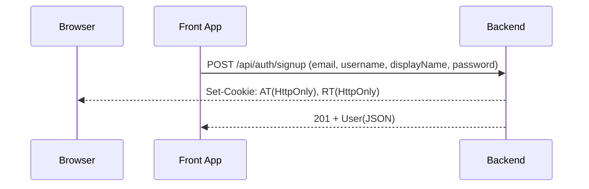
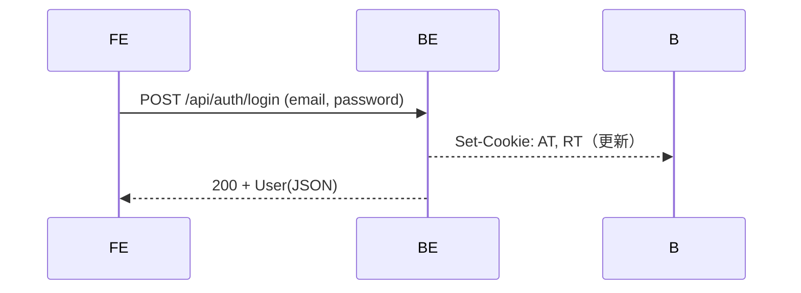
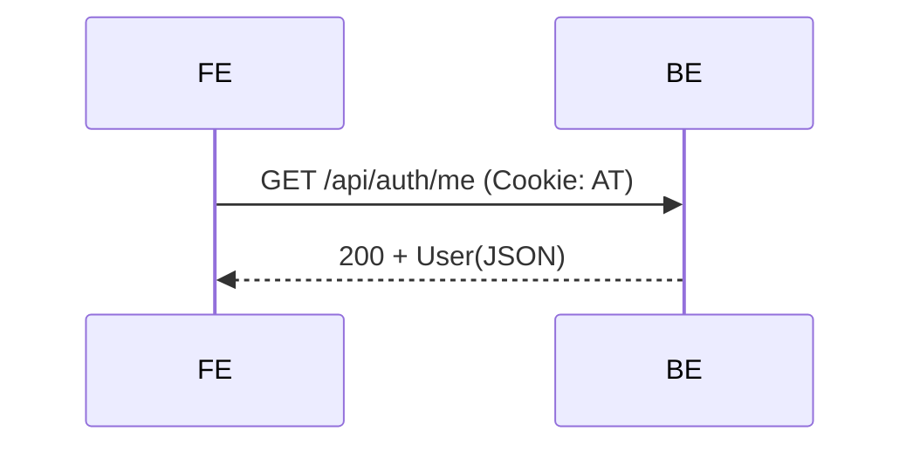
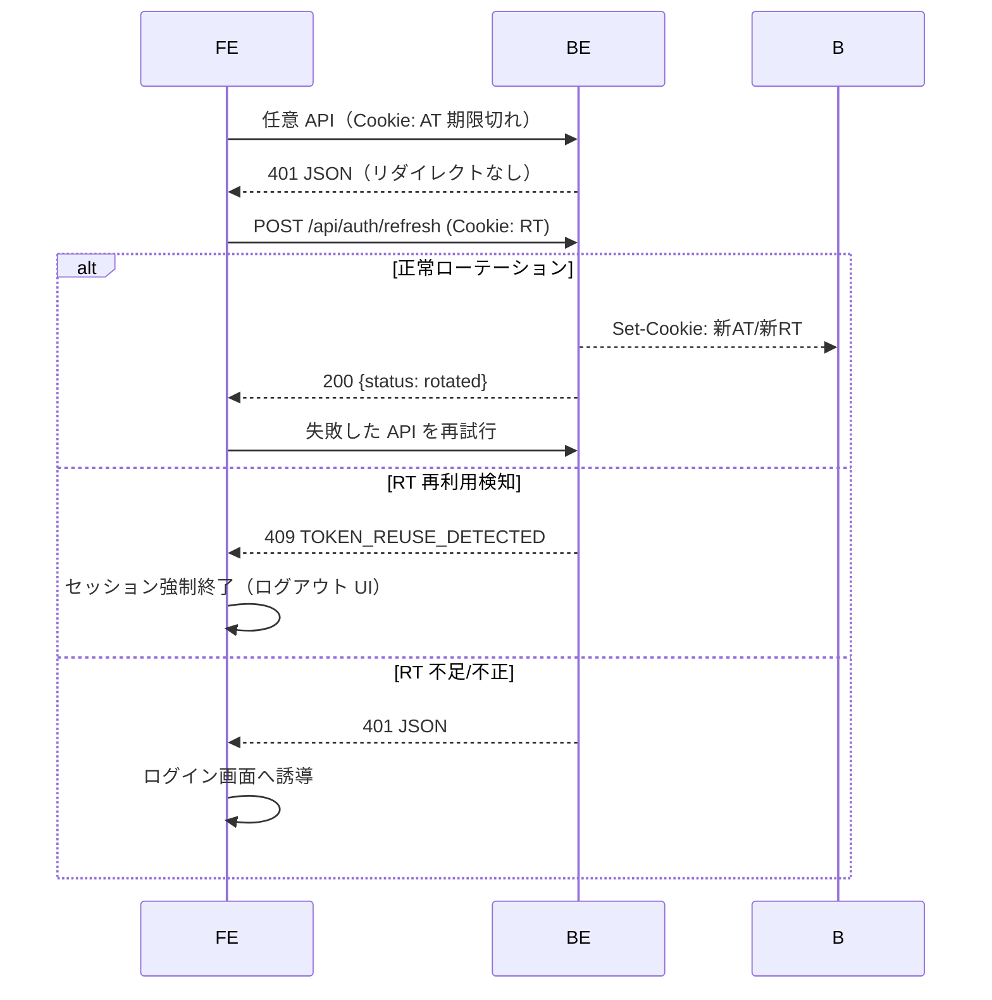
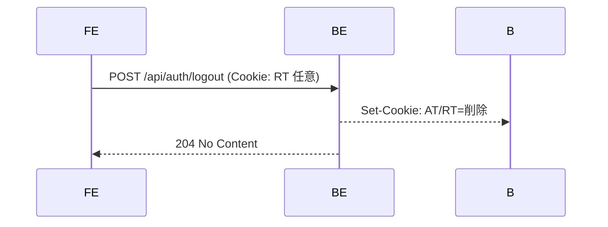
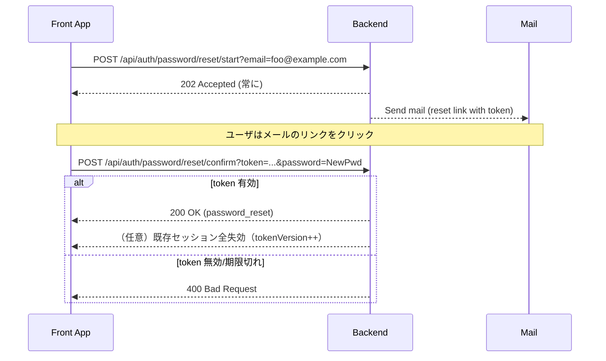

# フロントエンド統合ガイド（Auth）

本書は Web フロント（SPA/SSR）から本バックエンドの認証 API を安全に利用するための手順と実装例をまとめたものです。図は概念を掴むためのもの（Mermaid）。

## 1. 事前準備（設定）

- バックエンド URL とフロントのオリジン（Origin）を決める
  - 例）Backend: `https://api.example.com` / Front: `https://app.example.com`（別ドメイン）
- CORS（開発時）
  - `local` or `docker` プロファイル時のみ有効（`CorsConfig`）。
  - プロパティ `app.cors.allowed-origins` にフロントのオリジンを設定（カンマ区切り可）。
- Cookie 設定（JWT）
  - `app.jwt.cookieSameSite`: 同一サイト動作に合わせて `Strict`/`Lax`/`None` を選択。
    - 別ドメイン間で Cookie を送受信する場合は `None` を必須（HTTPS かつ Secure=true）。
  - `app.jwt.cookieSecure`: 本番では `true`（HTTPS 前提）。開発で HTTP の場合は `false` にする。
  - `app.jwt.cookieDomain`: 共有ドメインを指定する場合のみ設定（例: `.example.com`）。
  - `app.jwt.accessCookiePath`（初期値 `/`）、`app.jwt.refreshCookiePath`（初期値 `/auth`）で Cookie Path をプロパティ化。
    - ブラウザは「リクエストパスが Cookie の Path を前方一致」した時のみ送信します。
    - 例）バックエンドのリフレッシュが `/api/auth/refresh` なら `refreshCookiePath=/api/auth` を推奨。
- 鍵/JWKS（本番）
  - `APP_JWT_PRIVATE_JWKS_B64` に秘密 JWKS（先頭が active key）を Base64 で設定。
  - 公開鍵は `/.well-known/jwks.json` で配布（ETag/Cache-Control 付与）。
- メール
  - 開発: `app.mail.provider=logging`（ログ出力）
  - 本番: `app.mail.provider=resend`（`RESEND_API_KEY` 必須）または `smtp`（`spring.mail.*`）。

## 2. フロントの HTTP クライアント設定

Cookie に AT/RT（HttpOnly）を格納するため、必ず「クッキー同送」を有効化します。

例: Axios

```ts
import axios from 'axios';

export const api = axios.create({
  baseURL: process.env.NEXT_PUBLIC_API_BASE_URL, // 例: https://api.example.com
  withCredentials: true, // ← 必須（Cookie を送受信）
  headers: { 'Content-Type': 'application/json' },
});
```

Fetch の場合:

```ts
await fetch(`${API_BASE}/api/auth/login`, {
  method: 'POST',
  credentials: 'include', // ← 必須
  headers: { 'Content-Type': 'application/json' },
  body: JSON.stringify({ email, password }),
});
```

## 3. フロー（サインアップ/ログイン/リフレッシュ/ログアウト）

### 3.1 サインアップ



ポイント:
- レスポンスで Set-Cookie される AT/RT は HttpOnly のため、JS から読めません。クッキーはブラウザが保持し、以後のリクエストで自動送信されます。

### 3.2 ログイン



### 3.3 認証付き API 呼び出し



### 3.4 AT 失効時のリフレッシュ



実装例（Axios インターセプタ）:

```ts
api.interceptors.response.use(
  r => r,
  async (error) => {
    const { config, response } = error;
    if (!response) throw error;
    if (response.status === 401 && !config.__retried) {
      try {
        await api.post('/api/auth/refresh');
        config.__retried = true;
        return api.request(config);
      } catch (e: any) {
        if (e?.response?.status === 409) {
          // TOKEN_REUSE_DETECTED
          // → 強制ログアウト/全セッションクリア
        }
        // 401/その他 → ログインへ
      }
    }
    throw error;
  }
);
```

注意（重要）:
- RT Cookie Path は `app.jwt.refreshCookiePath` で変更できます。バックエンドのエンドポイントに合わせて設定してください。

### 3.5 ログアウト



## 4. メールフロー（任意）

- メール認証開始: `POST /api/auth/verification/start`（AT 必須）
- メール認証確定: `POST /api/auth/verification/confirm?token=...`
- パスワードリセット開始: `POST /api/auth/password/reset/start?email=...`（常に 202）
- パスワードリセット確定: `POST /api/auth/password/reset/confirm?token=...&password=...`

### 4.1 パスワードリセット図解



## 5. セッション管理

- 一覧: `GET /api/auth/sessions`
- 詳細: `GET /api/auth/sessions/{sid}`
- 1件失効: `DELETE /api/auth/sessions/{sid}`
- 全失効: `DELETE /api/auth/sessions?keepCurrent=true|false`

## 6. よくある落とし穴

- withCredentials/credentials=include を忘れる → Cookie が送受信されない
- SameSite が `Strict` のまま別ドメインで使う → Cookie が送られない
- Secure=false で `SameSite=None` を使う → ブラウザが拒否（`None` は Secure 必須）
- RT の Cookie Path とエンドポイントパスが不一致 → RT が送られない（要プロキシまたはサーバ改善）

## 7. 推奨プロキシ設定（例: nginx）

```nginx
location /auth/ {
  proxy_set_header Host $host;
  proxy_set_header X-Forwarded-For $proxy_add_x_forwarded_for;
  proxy_pass http://backend:8080/api/auth/;
}
```

フロントは `/auth/refresh` 等を呼び出し、ブラウザは Path=/auth の RT Cookie を送信します。
