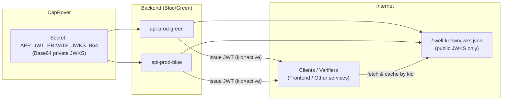
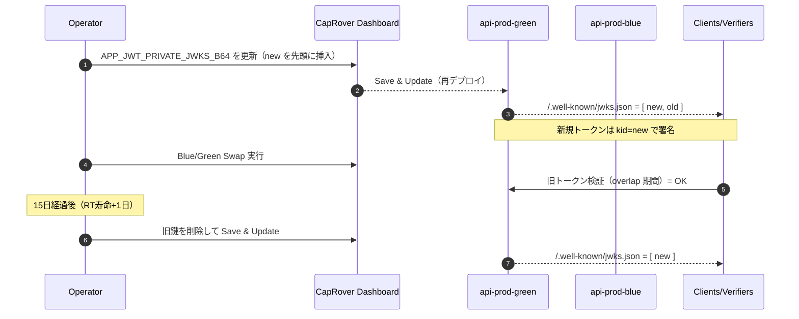

# JWKS鍵管理運用規程（CapRover Secret前提）

> 本規程は Tosk Backend における **JWK/JWKS の管理・配布・ローテーション**を、**CapRover Secret** を唯一の供給源として実施する手順・設定・運用ルールを定義する。推奨ではなく必須要件として定める。

---

## 1. 適用範囲

* 対象サービス: `api`（Spring Boot, Cookie ベース JWT 認証）
* デプロイ方式: **Blue/Green**（`api-prod-blue` / `api-prod-green`）
* 配信経路: Cloudflare（HTTPS/Full strict）
* 鍵保管: **CapRover Secret に格納した private JWKS（Base64）**
* バックエンドの鍵読み込み経路: **環境変数のみ**（ファイルパス経由は使用しない）

---

## 2. 用語

* **private JWKS**: 秘密鍵を含む JWK セット（内部専用、Base64 化して Secret に格納）
* **public JWKS**: 公開鍵のみの JWK セット。`/.well-known/jwks.json` で配布する
* **kid**: Key ID。`tosk-<YYYYMMDD>-<HHmm>` 形式とする（例: `tosk-20250829-1200`）
* **active 鍵**: private JWKS 配列の先頭要素。署名に使用する唯一の秘密鍵

---

## 3. 設定（不変仕様）

* 秘密鍵の保管先: **CapRover Secret**
* 環境変数名: **`APP_JWT_PRIVATE_JWKS_B64`**（Base64 化した private JWKS を格納）
* アプリの署名設定: `NimbusJwtEncoder` は **active 秘密鍵（先頭 1 本）** のみ使用
* アプリの検証設定: `NimbusJwtDecoder` は **public JWKS（全鍵）** を参照し `kid` で突合
* JWKS エンドポイント: `GET /.well-known/jwks.json`

    * コンテンツ: 公開鍵のみ（`kty`, `kid`, `n`, `e`）
    * ヘッダ: `Cache-Control: public, max-age=300` を必須とする
    * ETag を返す実装とし、If-None-Match に対応する
* プロファイル動作:

    * `prod` / `stg` / `preview`: 自動鍵生成 **禁止**。Secret 経由の注入のみ許可
    * `dev`: 鍵が存在しない場合に限り自動生成を **許可**（開発用のローカル保存先は `~/.tosk/keys/`）

### 3.1 図解（構成）



---

## 4. private JWKS 仕様

* JSON 構造（格納時は **Base64** 化する）

```json
{
  "keys": [
    {"kty":"RSA","kid":"tosk-20250829-1200","n":"<base64url>","e":"AQAB","d":"<base64url>","p":"<...>","q":"<...>","dp":"<...>","dq":"<...>","qi":"<...>"},
    {"kty":"RSA","kid":"tosk-20250601-0900","n":"<...>","e":"AQAB","d":"<...>","p":"<...>","q":"<...>","dp":"<...>","dq":"<...>","qi":"<...>"}
  ]
}
```

* **先頭要素が active 鍵**。以降は旧鍵（overlap 用）
* GitHub リポジトリへコミット **禁止**。配布・保管は Secret のみ

---

## 5. 鍵ローテーション規程

* 計画ローテ周期: **90 日**
* overlap 期間: **RT 最大寿命 + 1 日**。本システムでは **15 日**（RT=14 日）
* 署名アルゴリズム: **RS256** を使用する
* kid 命名: `tosk-<YYYYMMDD>-<HHmm>` 固定

### 5.1 手順（Blue/Green での実施順）

1. **新鍵生成**（ローカル・オフライン）→ PEM → JWK 変換 → `kid` 付与
2. **private JWKS 配列の先頭に新鍵を挿入**（`[ new, old, ... ]`）
3. JSON を **Base64 化** して `APP_JWT_PRIVATE_JWKS_B64` の値を更新（対象: `api-prod-green`）
4. **green 再デプロイ** → `/actuator/health` 正常 → `/.well-known/jwks.json` に **new/old の両 kid が併存** していることを確認
5. **Blue/Green Swap 実行**（以降の署名は new の kid）
6. **15 日経過** 後、private JWKS から旧鍵を削除 → `APP_JWT_PRIVATE_JWKS_B64` を更新 → green 再デプロイ →（必要に応じて）Swap

#### 図解（時系列：Blue/Green ローテ）



### 5.2 緊急ローテ（漏えい疑い発生時）

1. 新鍵を先頭に設定 → green 反映 → Swap を **即時** 実施
2. public JWKS から旧鍵を **即時撤去**（private JWKS からも削除）
3. `users.token_version` を **インクリメント** し、全 JWT を失効
4. 監査ログの収集・影響範囲の通知・パスワードリセット案内を実施

---

## 6. 運用 Runbook

### 6.1 新鍵生成（RSA 2048, OpenSSL）

```bash
# 秘密鍵（PKCS#8）
openssl genpkey -algorithm RSA -pkeyopt rsa_keygen_bits:2048 -out new-private.pem
# 公開鍵
openssl rsa -in new-private.pem -pubout -out new-public.pem
```

PEM → JWK 変換はリポジトリ内ユーティリティ（Java/Nimbus or Node）を使用し、`kid` を付与して `new.jwk.json` を得る。

### 6.2 Secret 更新（CapRover ダッシュボード）

1. **CapRover ダッシュボード**にログインし、`api-prod-green` を開く。
2. 左メニュー **App Configs** → **Environmental Variables & Secrets** を選択。
3. 変数 **APP\_JWT\_PRIVATE\_JWKS\_B64** に、先頭へ新鍵を挿入した **private JWKS（JSON）を Base64（改行なし）** で貼り付けて更新する。
4. 画面下部の **Save & Update** を押下する。更新によりアプリが再デプロイされる。自動で再デプロイされない環境では、**Deploy** タブの **Redeploy** を実行する。
5. 更新後、`/actuator/health` が **UP** であること、`/.well-known/jwks.json` に **new/old の両 `kid`** が併存していることを確認する。

#### 画面ナビ（イメージ）

```
CapRover Dashboard
└─ api-prod-green
   ├─ App Configs
   │   └─ Environmental Variables & Secrets
   │       └─ APP_JWT_PRIVATE_JWKS_B64 = <Base64 (no newlines)>
   └─ Deploy
       └─ Redeploy（必要時）
```

### 6.3 overlap 終了時の旧鍵削除（ダッシュボード）

1. ローカルで **private JWKS（JSON）** から削除対象の旧 `kid` を取り除く。
2. 修正後の JSON を **Base64（改行なし）** に変換する。
3. **CapRover ダッシュボード** → `api-prod-green` → **App Configs** → **Environmental Variables & Secrets** を開き、**APP\_JWT\_PRIVATE\_JWKS\_B64** を上記 Base64 値で置き換え、**Save & Update** を押下（必要に応じて **Deploy → Redeploy**）。
4. `/.well-known/jwks.json` から旧 `kid` が消えていることを確認する。

---

## 7. 公開 JWKS 仕様

* パス: `/.well-known/jwks.json`
* 内容: 公開鍵のみ（`kty`, `kid`, `n`, `e`）
* ヘッダ: `Cache-Control: public, max-age=300`、`ETag`（If-None-Match 対応）
* 許可: 認証不要の公開エンドポイント

---

## 8. 監査・可観測性

* 構造化ログ: `event=auth.key_rotated kid=<new> overlap_days=15`。PII（JWT/クッキー/秘密鍵）は出力禁止
* メトリクス: `jwks_keys_total`, `jwks_active_key_age_days`, `jwks_requests_total`, `token_reuse_detected_total`
* アラート: active 鍵の経過日数 > 90 日、JWKS 配信 5xx、署名検証失敗率の異常上昇

---

## 9. 通知・スケジュール

* 計画ローテ告知: **75 日経過** 時点で事前リマインド、**90 日** 到達でローテ実施通知
* 実装: GitHub Actions の週次ジョブで `/.well-known/jwks.json` を取得し、`kid` 規則から経過日数を算出 → Issue 作成と Slack/Discord Webhook 通知

```yaml
name: jwks-rotation-reminder
on:
  schedule: [{ cron: '0 3 * * 1' }]
jobs:
  remind:
    runs-on: ubuntu-latest
    steps:
      - name: Check JWKS age
        run: |
          curl -s https://api.example.com/.well-known/jwks.json -o jwks.json
          # kid/日付規則に基づき経過日数を計算し、75/90 日で通知するスクリプトを呼び出す
```

---

## 10. 受入基準（Definition of Done）

* `APP_JWT_PRIVATE_JWKS_B64` が **green** に設定され、再デプロイ後に `/.well-known/jwks.json` に **new/old kid が併存** している
* Swap 後、新規発行トークンが **new kid** で署名され、旧トークンが **15 日間** 検証成功となる
* 15 日経過後に旧鍵が撤去されている
* ログに PII/秘密が出力されていない

---

## 11. 禁則事項

* private JWKS を GitHub・共有ストレージ・チケットに貼り付けない
* `prod/stg/preview` での自動鍵生成を行わない
* 再起動時に鍵を再生成しない（既発行トークンの無効化を招く）

---

## 12. 変更管理

* 本規程の改訂はセキュリティ責任者の承認を必須とする
* 改訂時は影響範囲（CI/CD、アプリ設定、Runbook、通知設定）をレビューし、全環境へ同時反映する
