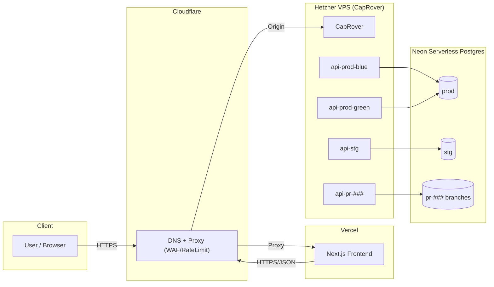

# Tosk インフラ設計ドキュメント（VPS×CapRover／Neon／Vercel／Cloudflare）

> スコープ：バックエンド（Spring Boot）を VPS 上の CapRover で運用。DB は Neon（サーバレス Postgres）のブランチ運用。フロントは Vercel。DNS/公開・WAF は Cloudflare。STG は Rolling、PROD は Blue/Green。PRごとに一時プレビュー（feature）。

---

## 1. 目的・非機能要件

* **可用性**：PROD は Blue/Green により無停止切替（アプリ側 Swap）。
* **変更容易性**：PR 作成で自動プレビュー（バックエンド／DBブランチ）。
* **コスト最適化**：単機 VPS から開始。ALB 等の固定費ゼロ。DB は Neon Free/Launch を使い分けて最小化。
* **セキュリティ**：最小権限・秘密情報の分離、Cloudflare WAF、Zero-Trust でプレビュー保護。
* **拡張性**：Hetzner EU→SG への移行、VPS 水平スケール（Swarm）を段階的に可能に。

---

## 2. 環境レイヤ

* **prod**：CapRover アプリ `api-prod-blue` / `api-prod-green`（Swap）、Neon `prod`（Launch）。
* **stg**：CapRover アプリ `api-stg`（Rolling）、Neon `stg`（Free もしくは Launch 小枠）。
* **feature（PR Preview）**：CapRover アプリ `api-pr-<PR番号>`、Neon ブランチ `pr-<PR番号>`（`stg` から派生）。

> dev 常設は作らない方針。動作確認は feature→stg で二段審査。

---

## 3. 全体アーキテクチャ

---

## 4. コンポーネント設計

### 4.1 DNS / 公開

* Cloudflare で `api.example.com`（本番）と `*.api.dev.example.com`（非本番）を **プロキシ ON（オレンジ雲）**。
* TLS モード：**Full (strict)**。オリジンにも有効証明書（Let’s Encrypt or CF Origin Cert）。
* プレビュー公開を制限する場合は Cloudflare Access（Zero-Trust）で保護。

### 4.2 VPS（CapRover）

* 最初は単機（例：Hetzner EU CPX11 2vCPU/2GB）。
* 将来的に Docker Swarm クラスタへ昇格可能。HA が必要になったら 2–3 台構成＋Cloudflare LB を追加。
* CapRover アプリ命名規則：

    * `api-prod-blue` / `api-prod-green`
    * `api-stg`
    * `api-pr-<PR番号>`

### 4.3 アプリ（Spring Boot）

* Docker イメージを GHCR に push。タグは **`sha`**（不変）＋`pr-<id>`。
* 健康チェック：`/actuator/health`（readiness/liveness を分離できれば尚良し）。
* リソース制限：コンテナごとに CPU/メモリ上限を設定。

### 4.4 データベース（Neon）

* **prod**：専用プロジェクト（Launch）。バックアップと PITR を有効化。
* **stg**：Free or Launch 小枠。恒常ブランチ `stg`。
* **feature**：`stg` から **PR ごとにブランチ作成**→ マイグレーション → PR close で削除。
* 接続認証：アプリ用の **最小権限ユーザ**。マイグレーションは別ユーザで。

---

## 5. CI/CD（GitHub Actions）

### 5.1 トリガとフロー

* **feature (PR opened/reopened/synchronize)**

    1. Build → GHCR push
    2. Neon API：`stg` からブランチ作成 → 接続 URL 取得
    3. CapRover CLI：`api-pr-<PR>` 作成・環境変数 `DATABASE_URL` 設定・デプロイ
    4. PR close：CapRover アプリ削除、Neon ブランチ削除、GHCR の `pr-*` イメージ掃除

* **stg (push: main)**

    * Rolling デプロイ（CapRover 標準のゼロダウンタイム）。

* **prod (release: published)**

    * `api-prod-green` にデプロイ → ヘルス OK → **Swap**（Blue/Green 切替）→ 監視。
    * Swap 前に手動承認（環境プロテクション）を挟む。

### 5.2 シークレットと権限

* OIDC ではなく VPS 直 SSH のため、`CAPROVER_URL / CAPROVER_PASSWORD` を GitHub Environments に保存。
* GHCR は private。Actions は **SHA ピン**と fork PR の権限制限。

---

## 6. ネットワーク & セキュリティ

* **VPS**：UFW で `80/443/22` のみ許可。SSH は鍵認証、`PermitRootLogin no`、fail2ban。
* **CapRover**：ダッシュボードは強パスワード＋ 2FA。管理 URL は Cloudflare Access で保護可。
* **プレビュー**：Basic 認証または Access。`X-Robots-Tag: noindex`。
* **アプリ**：

    * CORS：ホワイトリスト（Vercel ドメイン、dev ドメイン）。
    * セッション：Cookie 利用時は `HttpOnly; Secure; SameSite=Strict`。JWT は短寿命＋`aud/iss` 検証。
    * セキュリティヘッダ：CSP / X-Frame-Options / X-Content-Type-Options / Referrer-Policy。
    * 依存スキャン：Dependabot / Trivy / OWASP Dependency-Check。
* **ログ**：プレビューは 7–14 日保持。PII は出力禁止。

---

## 7. 監視・運用

* **メトリクス**：アプリの基本メトリクス（req/s、P95、5xx、GC）。
* **アラート**：5xx の連続増加、レイテンシ閾値超、メモリ高止まり、DB 接続失敗。
* **バックアップ**：Neon prod の PITR／自動バックアップを一次線。アプリ層は stateless。
* **お掃除**：

    * PR close → CapRover/Neon/GHCR を自動削除。
    * 週次 GC（孤児コンテナ、未使用ボリューム、古いログ）。

---

## 8. コスト見積（ラフ）

* **VPS**：Hetzner EU（2GB）≈ €4–5/月。将来 SG に移行する場合は €7–8/月。
* **Neon**：

    * prod：Launch \$5〜 + CU/GB の従量（小規模で \$5–10 程度）。
    * non-prod：Free 枠内運用を基本。繁忙月は \$5 前後に上振れの可能性。
* **Cloudflare**：Free（WAF/Proxy/TLS）。LB 導入は多台化時に \$5/月〜。

---

## 9. 命名規約・ドメイン

* **アプリ名（CapRover）**：`api-prod-blue|green`, `api-stg`, `api-pr-<PR>`
* **ドメイン**：

    * 本番：`api.example.com`
    * 非本番：`pr-<PR>.api.dev.example.com`、`stg.api.dev.example.com`
* **DB ブランチ**：`prod`, `stg`, `pr-<PR>`

---

## 10. デプロイ手順（要約ランブック）

### 10.1 prod

1. GitHub Release 作成（published）
2. Actions が `api-prod-green` にデプロイ
3. ヘルス OK を確認
4. CapRover で **Swap**（Green→受け側）
5. ロールバックは Swap を反転

### 10.2 stg

1. `main` push で Rolling デプロイ
2. E2E/手動確認 → OK なら Release 作成へ

### 10.3 feature（PR）

1. PR open → GHCR build & push
2. Neon ブランチ作成 → URL 注入
3. CapRover に `api-pr-<PR>` を作成・デプロイ
4. PR close → 環境・DB・イメージ削除

---

## 11. 将来計画（拡張パス）

* **リージョン移行**：EU→SG（DNS 切替／短 TTL）。
* **多台化**：VPS×2 以上 + Cloudflare Load Balancer（ヘルスチェック＋ウェイト切替）。
* **観測**：SaaS APM（Datadog/ElasticAPM）または OpenTelemetry 導入検討。
* **IaC**：CapRover 設定（apps/env）をレポ化 or スクリプト化して再現性を担保。

---

## 12. 付録

### 12.1 ポート/ファイアウォール

* Inbound：80, 443, 22（限定）
* Outbound：Neon, GHCR, Vercel Webhook, Package Repos

### 12.2 主要環境変数（例）

* `DATABASE_URL`（環境別）
* `SPRING_PROFILES_ACTIVE=prod|stg|preview`
* `JWT_*` / Cookie 設定

### 12.3 リスクレジスタ（要監視）

* PR 環境作りっぱなし → コスト/攻撃面でリスク（自動掃除で回避）
* 秘密情報の混入（CI ログ/イメージ） → マスク／出力禁止
* 依存アップデート停滞 → 月次点検（CVE）

---

*このドキュメントは“最小コストで開始し、必要に応じて段階拡張”の思想で設計しています。運用を通して数値が貯まったら、メトリクスを根拠に各閾値・リソースサイズ・コストを見直す予定*
